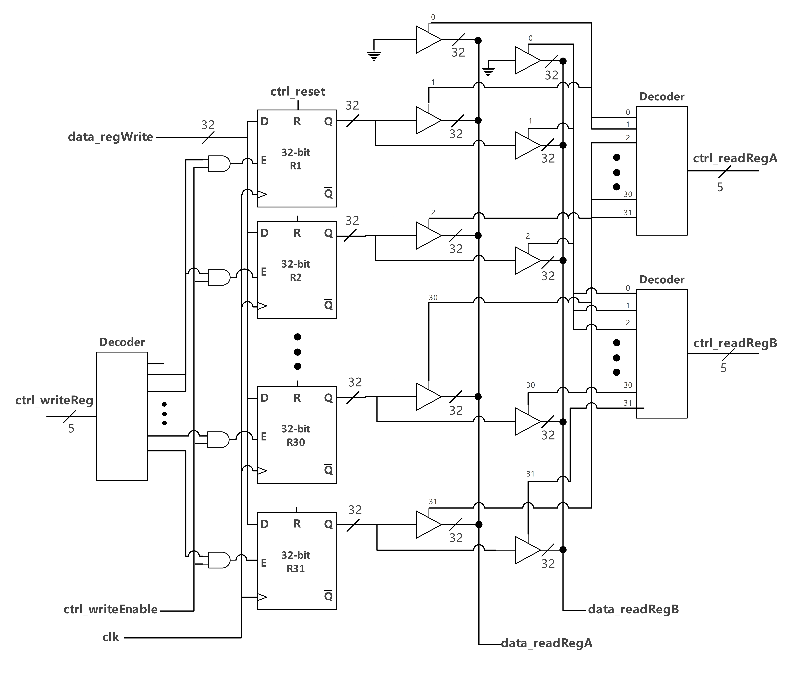

# Project Checkpoint 3

- Name: Fangcheng Guo
- NetID: fg96

## Overview

The aim of this project checkpoint is to design and simulate a register file using verilog. The register file is essential in the ALU for reading and writing register. The implemented register file must support:

- 2 read ports
- 1 write ports
- 32 32-bit registers

## Description of Design (Overall)

The design for the overall regfile utilizes 32 32-bit register, and three 5-to-32 decoders for in order to convert the binary number (5-bit control binary) into "one hot". The overall design of the regfile is shown in the image below the overall regfile is divided into two parts, the left part (shown in the image) is mainly responsible for writing into the register. The `ctrl_writeReg` is converted into 32bit one-hot, and connects AND gate with`ctrl_writeEnable`, after which the output is connected to the Enable port on the 32-bit register. This design is to ensure the highest priority of `ctrl_writeEnabled`, so that if it is false, the register will not be written. After that, if `ctrl_writeEnabled` is true and the one-hot encoding found that RX is what we want to write, then the AND gate will output 1 and the Enabled port on RX will be activated. 

The right part (shown in the image) is mainly responsible for reading from the register. The binary form `ctrl_readRegA` and `ctrl_readRegB` is converted into two 32-bit one hot. Instead of designing a 32bit mux to choose the 32 output port (Q) of 32 registers, the alternative is to connect the output of 32 register to 32 tristate buffers, with each Enabled port connects to the each bit from the decoder. This way, if the Enabled bit is one, the 32-bit register data will flow through the tristate buffer and output in `data_readRegA/B`. If the Enabled bit is zero, the tristate buffer will behave like an open circuit and the 32-bit register data will not flow through.

If cannot see the image, please find the link [here](https://drive.google.com/file/d/1lQyfSuTF-MPF5qVyvufEdXKPHhOFRgYA/view?usp=sharing)

## Description of Design (5 to 32 decoder)

The truth table for a 5-to-32 decoder is listed below:

A 5-to-32 decoder takes 5 input lines and produces 32 output lines. Here is a truth table for a 5-to-32 decoder:

| Input (5 bits) | Output (32 bits)                 |
| -------------- | -------------------------------- |
| 00000          | 00000000000000000000000000000001 |
| 00001          | 00000000000000000000000000000010 |
| 00010          | 00000000000000000000000000000100 |
| 00011          | 00000000000000000000000000001000 |
| 00100          | 00000000000000000000000000010000 |
| 00101          | 00000000000000000000000000100000 |
| 00110          | 00000000000000000000000001000000 |
| 00111          | 00000000000000000000000010000000 |
| 01000          | 00000000000000000000000100000000 |
| 01001          | 00000000000000000000001000000000 |
| 01010          | 00000000000000000000010000000000 |
| 01011          | 00000000000000000000100000000000 |
| 01100          | 00000000000000000001000000000000 |
| 01101          | 00000000000000000010000000000000 |
| 01110          | 00000000000000000100000000000000 |
| 01111          | 00000000000000001000000000000000 |
| 10000          | 00000000000000010000000000000000 |
| 10001          | 00000000000000100000000000000000 |
| 10010          | 00000000000001000000000000000000 |
| 10011          | 00000000000010000000000000000000 |
| 10100          | 00000000000100000000000000000000 |
| 10101          | 00000000001000000000000000000000 |
| 10110          | 00000000010000000000000000000000 |
| 10111          | 00000000100000000000000000000000 |
| 11000          | 00000001000000000000000000000000 |
| 11001          | 00000010000000000000000000000000 |
| 11010          | 00000100000000000000000000000000 |
| 11011          | 00001000000000000000000000000000 |
| 11100          | 00010000000000000000000000000000 |
| 11101          | 00100000000000000000000000000000 |
| 11110          | 01000000000000000000000000000000 |
| 11111          | 10000000000000000000000000000000 |

Hence, the logic for each gate is represented as:

- $$
  out0 = in0' \cdot in1' \cdot in2' \cdot in3' \cdot in4'
  $$

- $$
  out1 = in0 \cdot in1' \cdot in2' \cdot in3' \cdot in4'
  $$

- $$
  out2 = in0' \cdot in1 \cdot in2' \cdot in3' \cdot in4'
  $$
  
- $$
  out3 = in0 \cdot in1 \cdot in2' \cdot in3' \cdot in4'
  $$
  
- $$
  out4 = in0' \cdot in1' \cdot in2 \cdot in3' \cdot in4'
  $$

- $$
  out5 = in0 \cdot in1' \cdot in2 \cdot in3' \cdot in4'
  $$
  
- $$
  out6 = in0' \cdot in1 \cdot in2 \cdot in3' \cdot in4'
  $$
  
- $$
  out7 = in0 \cdot in1 \cdot in2 \cdot in3' \cdot in4'
  $$

- $$
  out8 = in0' \cdot in1' \cdot in2' \cdot in3 \cdot in4'
  $$
  
- $$
  out9 = in0 \cdot in1' \cdot in2' \cdot in3 \cdot in4'
  $$
  
- $$
  out10 = in0' \cdot in1 \cdot in2' \cdot in3 \cdot in4'
  $$
  
- $$
  out11 = in0 \cdot in1 \cdot in2' \cdot in3 \cdot in4'
  $$
  
- $$
  out12 = in0' \cdot in1' \cdot in2 \cdot in3 \cdot in4'
  $$
  
- $$
  out13 = in0 \cdot in1' \cdot in2 \cdot in3 \cdot in4'
  $$

- $$
  out14 = in0' \cdot in1 \cdot in2 \cdot in3 \cdot in4'
  $$

- $$
  out15 = in0 \cdot in1 \cdot in2 \cdot in3 \cdot in4'
  $$
  
- $$
  out16 = in0' \cdot in1' \cdot in2' \cdot in3' \cdot in4
  $$
  
- $$
  out17 = in0 \cdot in1' \cdot in2' \cdot in3' \cdot in4
  $$
  
- $$
  out18 = in0' \cdot in1 \cdot in2' \cdot in3' \cdot in4
  $$
  
- $$
  out19 = in0 \cdot in1 \cdot in2' \cdot in3' \cdot in4
  $$
  
- $$
  out20 = in0' \cdot in1' \cdot in2 \cdot in3' \cdot in4
  $$
  
- $$
  out21 = in0 \cdot in1' \cdot in2 \cdot in3' \cdot in4
  $$
  
- $$
  out22 = in0' \cdot in1 \cdot in2 \cdot in3' \cdot in4
  $$
  
- $$
  out23 = in0 \cdot in1 \cdot in2 \cdot in3' \cdot in4
  $$
  
- $$
  out24 = in0' \cdot in1' \cdot in2' \cdot in3 \cdot in4
  $$
  
- $$
  out25 = in0 \cdot in1' \cdot in2' \cdot in3 \cdot in4
  $$
  
- $$
  out26 = in0' \cdot in1 \cdot in2' \cdot in3 \cdot in4
  $$
  
- $$
  out27 = in0 \cdot in1 \cdot in2' \cdot in3 \cdot in4
  $$
  
- $$
  out28 = in0' \cdot in1' \cdot in2 \cdot in3 \cdot in4
  $$
  
- $$
  out29 = in0 \cdot in1' \cdot in2 \cdot in3 \cdot in4
  $$
  
- $$
  out30 = in0' \cdot in1 \cdot in2 \cdot in3 \cdot in4
  $$

- $$
  out31 = in0 \cdot in1 \cdot in2 \cdot in3 \cdot in4
  $$
## Additional self-designed module

1. `and_5input`: It is basically an and gate with 5-bit input. This is to accommodate the design for 5-to-32 decoder because each bit on the output (32 bit) requires the logical calculation (all AND gate for five bit with different logical equation)
1. `register_32bit`: It is basically 32 d-flip-flop connected in sequence. When designing in a module like this, it will save a lot of time when building the entire regfile.
1. `tristate_buffer_32bit`: a 32-bit tristate buffer with one-bit enable port and a 32-bit output, just like the normal 1-bit tristate_buffer, if the enable is one, it will output whatever the input is, otherwise, there will be high impedance and the data will not pass through.
