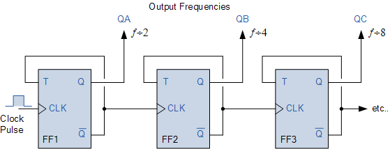

# Project Checkpoint 4

## Overview
The aim of this project is to design and simulate a single-cycle 32-bit processor using Verilog. In this checkpoint specifically, we aim to implement `add`, `addi`, `sub`, `and`, `or`, `sll`, `sra`, `sw`, and `lw` instructions. The objectives of this checkpoint include:

1. Integrates register file and ALU
2. Properly generates the dmem and imem files by generating Quartus syncram components

## Overall design for single cycle processor
The image shown below illustrates our overall design in this checkpoint for single cycle processor. The control unit for this checkpoint will output 7 control bit:

1. **Rwe**: write enable for register file
2. **Rdst**: determine the write destination register
3. **ALUinB**: determine whether the command is addi or add
4. **is_addi_add_sub**: determine whether the command is addi, add or sub, not anything else.
5. **IsRType**: output 1 if the command is R type, output 0 if the command is I type.
6. **OFSignal**: Overflow signal, if add overflow, it outputs 1. If addi overflows, it outputs 2. If sub overflows, it outputs 3. The overflow signal is 32-bit.
7. **DMwe**: write enable for Data Memory
8. **Rwd**: determine whether the command is for `lw` or `sw`

## Clock Design and Clock Divider
In this project checkpoint, one of the requirement for testing the processor is to design 4 clock: processor clock, register clock, instruction memory clock and data memory clock. Given 50MHz clock, we design and implement the following setup of clock:

In order to make slower clock, a divider module is designed using DFFE as shown in the following figure:

## The design of the control unit

In order to accomodate for the requirement of each control unit, the logical expression for the following control unit is listed below:

- **Rwe**: output 1 for all R-type instruction and `addi (00101)`, `lw (01000)`
$$
    Rwe = isRType \ || \ opcode[addi] \ || \ opcode[lw] 
$$
- **Rdst**: output 1 for I-type instructions and `sll (opcode: 00000, ALUopcode: 00100)` and `sra (opcode: 00000, ALUopcode: 00101)`
$$
    Rdst = !isRType \ || \ (opcode[00000] \ \&\& \ ALUop[00100]) \ || \ (opcode[00000] \ \&\& \ ALUop[00101]) 
$$
- **ALUinB**: output 1 if for I-type isntructions only
$$
    ALUinB = \ !isRType \ (works \ for \ this \ checkpoint \ only)
$$
- **is_addi_add_sub**: as the name suggest, output 1 only when the instruction belongs to `add (opcode: 00000, ALUop: 00000)`, `addi (00101)` or `sub (opcode: 00000, ALUop: 00001)`:
$$
    is\_addi\_add\_sub: opcode[add] \ || \ opcode[addi] \ || \ opcode[sub]
$$
- **IsRType**: as in current checkpoint, there are only two types of instruction, R and I type. The way to judge whether an instruction is R-type is simple - check opcode to see whether it equals to 00000.
$$
    IsRType = opcode[00000]
$$
- **OFSignal**: Overflow signal, if add overflow, it outputs 1 (32'b1). If addi overflows, it outputs 2 (32'b2). If sub overflows, it outputs 3 (32'b3). The overflow signal is 32-bit.
$$
    OFSignal \\
    = 1 \ if \ add \ \\
    = 2 \ if \ addi \\
    = 3 \ if \ sub \\ 
$$
- **DMwe**: output 1 if the instruction is `sw (00111)`
$$
    DMwe = opcode[00111]
$$
- **Rwd**: output 1 if the instruction is `lw (01000)`
$$
    Rwd = opcode[01000]
$$

## Other self-designed modules
1. `CLA_12bit.v` used for doing addition for PC register
2. `register_32bit.v` used for the basic storage module (32-bit register)
3. `signExtension.v` used for adding 0’s or 1’s accordingly at the
beginning of the immediate value to make it 32 bits.
