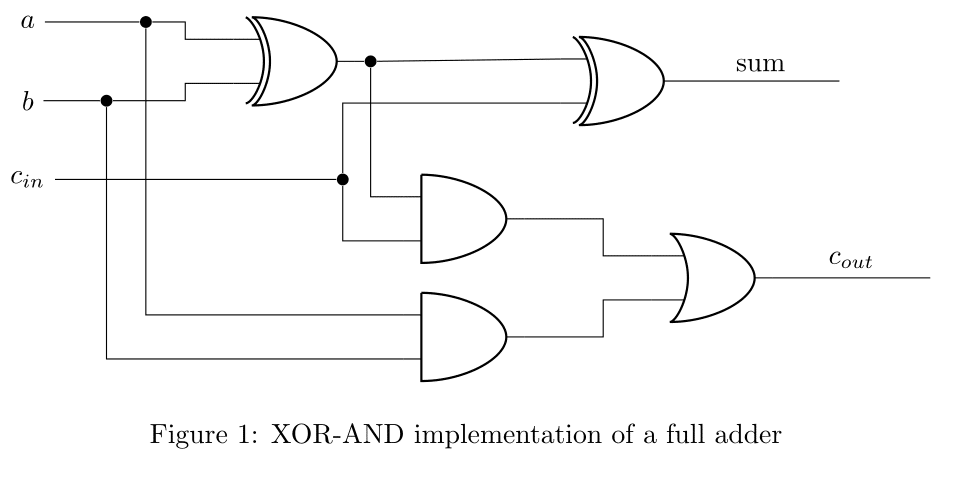

# Recitation 2
The aim of this recitation is to build a 4-bit Ripple Carry Adder (RCA) in Verilog and test your adder using waveforms and testbenches.

## Tasks

- Task 1: Building a full adder and then using the validated full adder to build a 4-bit RCA
- Task 2: Using a vector waveform to validate the operation of your circuit
- Task 3: Writing a testbench to validate the operation of your circuit

## Source Files

- [full_adder.v](full_adder.v): full adder using XOR-AND implementation

  

- [ripple_carry_adder.v](ripple_carry_adder.v): Ripple Carry Adder(RCA) implementation

- Waveform.vwf: the waveform for testing the Full adder we implemented.

- Waveform1.vwf: the waveform for testing the Ripple Carry Adder we implemented.

- [ripple_carry_adder_tb.v](ripple_carry_adder_tb.v): testbenches for testing the Ripple Carry Adder we implemented.

## Example Test Cases for 4-bit RCA

| A (4-bit) | B (4-bit) | Cin  | Sum (4-bit) | Cout |
| ---- | ---- | ---- | ---- | ---- |
| 0000 | 0000 | 0    | 0000 | 0    |
| 0000 | 0000 | 1    | 0001 | 0    |
| 0000 | 0001 | 0    | 0001 | 0    |
| 0000 | 0001 | 1    | 0010 | 0    |
| 0000 | 0010 | 0    | 0010 | 0    |
| 0000 | 0010 | 1    | 0011 | 0    |
| 0000 | 0011 | 0    | 0011 | 0    |
| 0000 | 0011 | 1    | 0100 | 0    |
| 0001 | 0000 | 0    | 0001 | 0    |
| 0001 | 0000 | 1    | 0010 | 0    |
| 0001 | 0001 | 0    | 0010 | 0    |
| 0001 | 0001 | 1    | 0011 | 0    |
| 0001 | 0010 | 0    | 0011 | 0    |
| 0001 | 0010 | 1    | 0100 | 0    |
| 0001 | 0011 | 0    | 0100 | 0    |
| 0001 | 0011 | 1    | 0101 | 0    |

