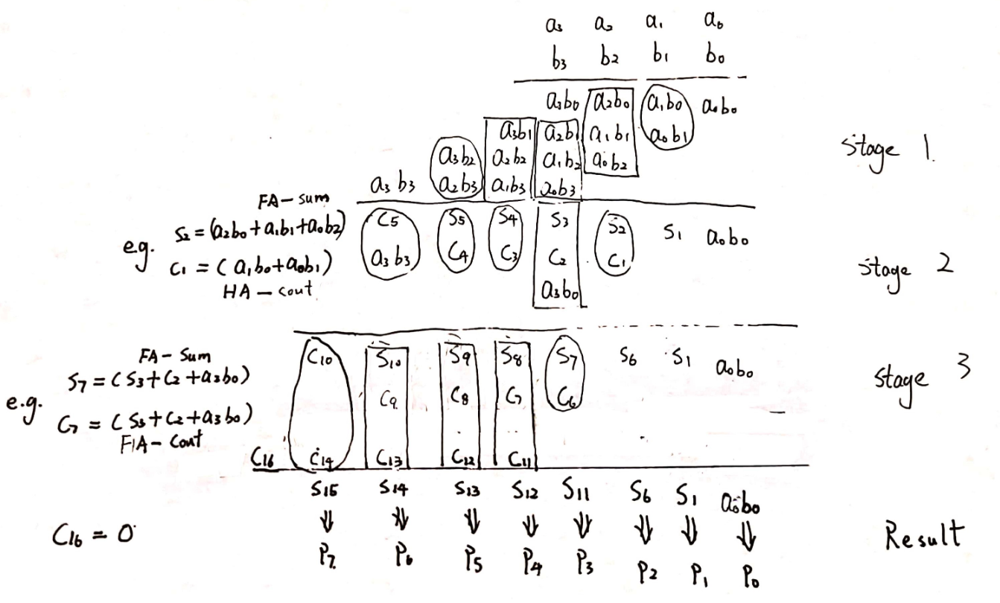
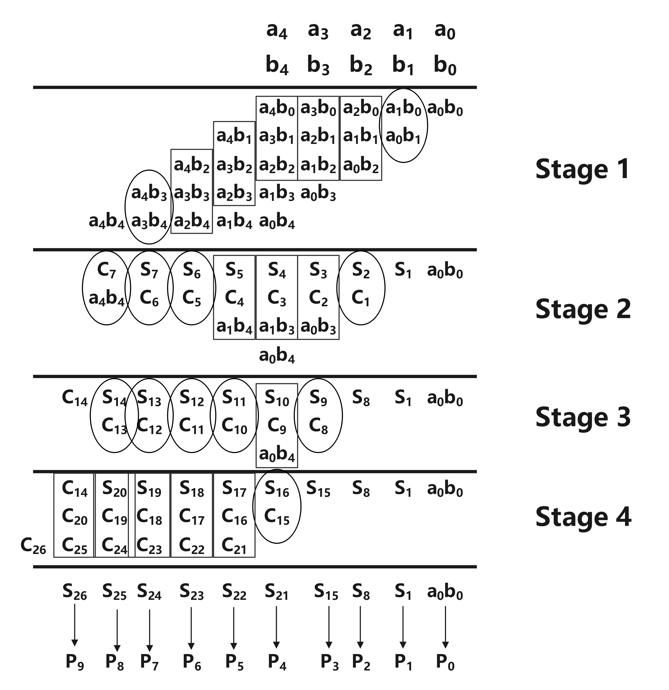
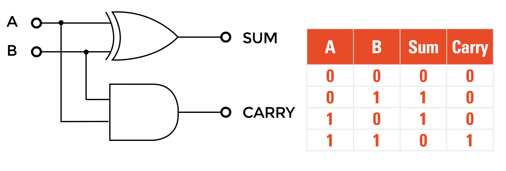

# Recitation 3
The aim of this recitation is to first learn the basics of Wallace Tree Multipliers (WTM) from a 4x4 WTM example. Then to build your own 5x5 WTM and write a testbench to test it. 

## Tasks

- Task 1: Understand Wallace Tree Multipliers (WTM) from a 4x4 example and then build a 5x5 WTM.
- Task 2: Validate the correctness of your WTM with a testbench.

## Wallace Tree Multipliers (WTM)

A Wallace tree is an efficient hardware implementation of a digital circuit that multiplies two integers. We are going to use a 4x4 WTM as an example.

As shown in the following illustration, a WTM operates in several stages. For an NxN WTM, we would have N^2 numbers in Stage 1. Then, at each stage, we use full adders (FA) and half adders (HA) to reduce the number of partial products until reaching the final result. 

First figure is the operation of a 4x4 WTM shown in a multiplication table provided by the official documents of recitation 3:

****

Second is a figure of the operation of a 5x5 WTM shown similarly in a multiplication table. The figure is produced by me.

****

The implementation of the WTM in circuit block is designed as follow:

## Source Files

- [full_adder.v](full_adder.v): full adder implementation, same as the recitation 2

- [half_adder.v](half_adder.v): half adder implementation, the half adder is implemented using an AND gate as the carry and XOR as the sum.

  

- [WTM.v](WTM.v): the implementation of the above circuit in Verilog
- [WTM_tb.v](WTM_tb.v): the test benches of the above designed WTM.
