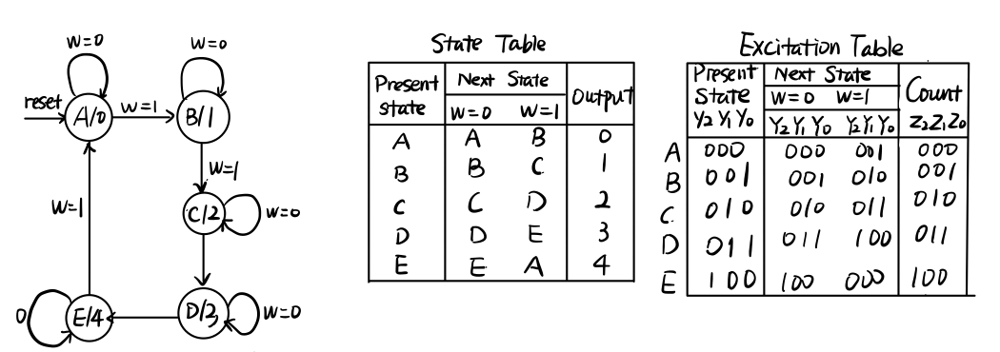
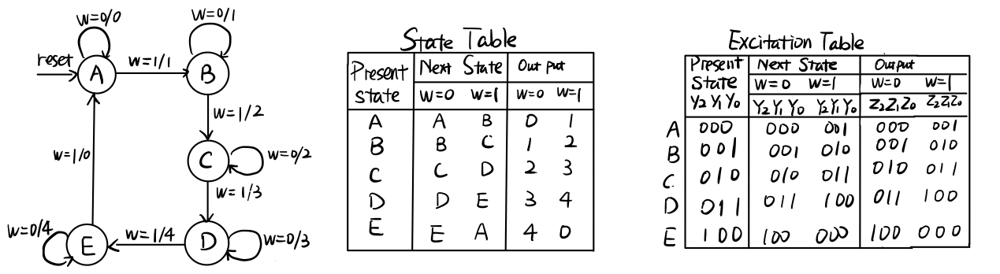

# Recitation 3
The aim of this recitation is to first creating Moore and Mealy state designs for modulo-5 counter, after that, draw the State Diagram, and be able to differentiate them. Secondly, implement the modulo-5 counter in Quartus using Behavioral Verilog.

## Tasks

- Task 1: Design both a Moore and a Mealy style modulo-5 counter, Draw the State Diagram, and be able to differentiate them. 
- Task 2: Implement the modulo-5 counter in Quartus

## Moore Design

Definition: Outputs are only a function of present state variables.

The state diagram and state table for Moore Design for modulo-5 counter is listed below:

## Mealy Design

Definition: Outputs are a function of both present state and input variables.

The state diagram and state table for Moore Design for modulo-5 counter is listed below:

## Moore V.S. Mealy

Following are the differences in Mealy and Moore design:

- In Moore machine, the outputs depend on states only, therefore it is __'synchronous
  machine'__. Whereas, in Mealy machine output depends on states along with external inputs and the output is available as soon as the input is changed therefore it is __'asynchronous machine'__.
- Mealy machine (usually) requires fewer number of states as compared to Moore machine.
