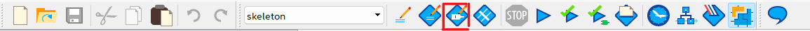
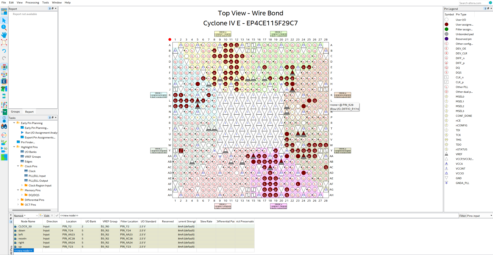
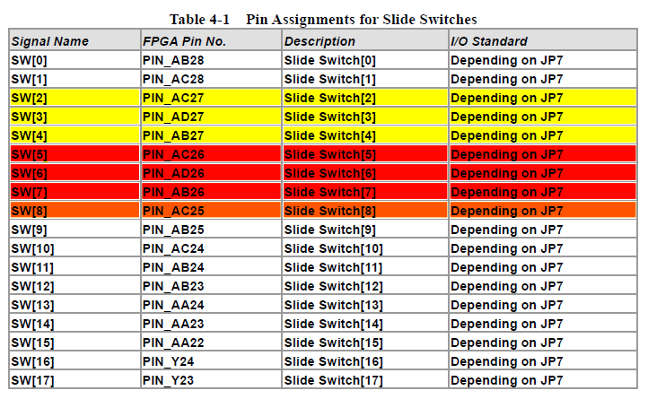
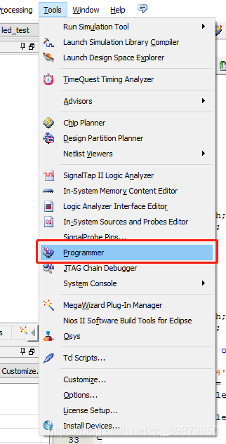
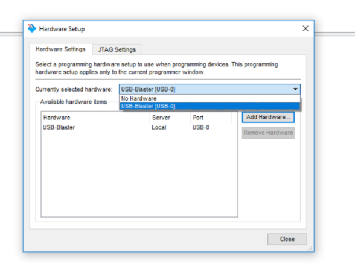

# Recitation 6

The aim of this recitation is to learn how to load your design on reconfigurable hardware (i.e., the FPGA chip on our DE2 board) and run it on it. FPGAs are integrated circuits that mainly use look-up tables (LUTs) to reconfigure themselves electronically.

## Equipment

- Computer with Quartus Prime software
- DE2 FPGA board

## Tasks

- Task1: Light up LEDs on the FPGA board
- Task2: Create a 3-bit adder and show results on 7-segment displays

## Task1: Control the LEDs on the Board

Add code to the `led_test.v` file:

```verilog
module led_test(led_high,led_low,clk,rst_n,s0);
	output[1:0] led_high;
	output[1:0] led_low;
	input clk,rst_n,s0;
	reg[1:0] led_high,led_low;

always @(posedge clk or negedge rst_n) begin
	if(~rst_n)
		led_high <= 2'b00;
	else 
		led_high <= led_high+1'b1;
end

always @(*) begin
	case(s0)
		1'b0 : led_low <=2'b01;
		1'b1 : led_low <=2'b10;
		default:led_low <=2'b00;
	endcase
end

endmodule
```

After full compilation, assign inputs and outputs to the appropriate FPGA pins.





The reference for the relationship between pin and the slide switch is listed below:



Click compilation again, and select “Programmer” under “Tools”.



Click “Hardware setup”. If it shows "No Hardware", need to install the USB Blaster Driver [here](https://www.terasic.com.tw/wiki/Altera_USB_Blaster_Driver_Installation_Instructions)

You should be able to see:



Click on “Add Files” and navigate to “output_files”. Select the .sof file corresponding to your compiled module. Click “Start”.

## Build a 3-bit Adder and Control It on the Board

Add the code below to a new file. The following code contains two modules. One is a 2-bit adder and the other helps you display one number on a 7-segment display.

```verilog
module twobitadder(
	input [1:0]a,b,
	input cin,
	output [0:6] HEX1,HEX0
);
reg [3:0]sum,cout;

always@(*) begin
 
	cout <= 0;
	sum <= a + b + cin;
end

sevensegment sevensegment0(sum,HEX0);
sevensegment sevensegment1(cout,HEX1);

endmodule


module sevensegment(
	input [3:0]in2,
	output reg[6:0]display
);
always@(*) begin
    case(in2)
    0 : display = 7'b0000001;
    1 : display = 7'b1001111;
    2 : display = 7'b0010010;
    3 : display = 7'b0000110;
    4 : display = 7'b1001100;
    5 : display = 7'b0100100;
    6 : display = 7'b0100000;
    7 : display = 7'b0001111;
    8 : display = 7'b0000000;
    9 : display = 7'b0000100;
    default: display = 7'b1111111;
    endcase
end
endmodule
```

Now change to 3-bit adder

```verilog
module threebitadder(
	input [2:0]a,b,
	input cin,
	output [0:6] HEX1,HEX0
);
reg [4:0]sum1, sum2,cout;

always@(*) begin
 
	cout <= 0;
	sum1 <= (a + b + cin) / 10;
	sum2 <= (a + b + cin) % 10;
	
end

sevensegment sevensegment0(sum2,HEX0);
sevensegment sevensegment1(sum1,HEX1);

endmodule
```

