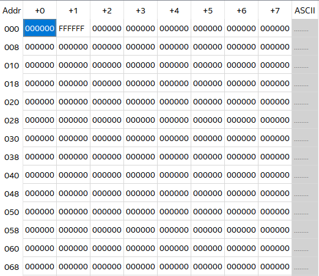
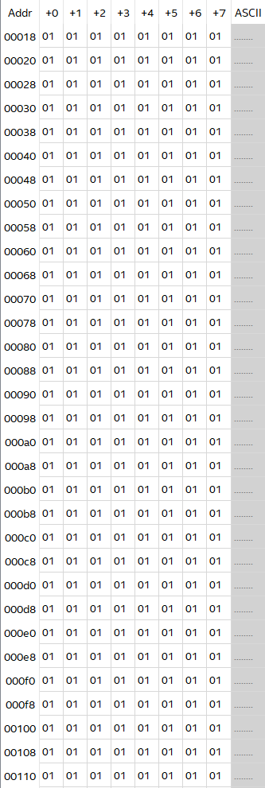

# Recitation 8

This recitation focus on VGA interfaces and controllers. We will study the VGA controller and practice loading .mif files into their project directory and alter the code so that the slide switches on the FPGA will be used to control the memory location holding the information for an image to be displayed.

## Equipment

- Computer with Quartus Prime software
- DE2 FPGA board
- VGA Monitor

## Tasks

- Task 1: Understand the VGA architecture and display different images on a VGA screen through the FPGA board

## Understanding the VGA

### vga_controller.v

The main idea behind how VGA works is that for each pixel on the screen, there is a 3- byte code that designates the values for red, blue, and green that the pixel will have. One byte for red, one for blue, one for green. The controller controls the image on the screen by updating one pixel at a time, doing all of the pixels in a given row on the screen, moving down to the next row, and similarly updating the color at each pixel. Once the controller gets to the last pixel on the screen, it moves back to the pixel at the beginning of the screen and starts the process over. The color that a pixel takes on is the additive result of the red, blue, and green color values (e.g. white is 0xFFFFFF, black is 0x000000)

There is a section where Page 2 of 3 instances of img_data.v and img_index.v are called and connected to the signals in the VGA controller. 

- `img_index.v`: controls what pixel location we are at 
- `img_data.v`: controls what the pixel value will be at that location

For every byte in the `reci_img_data.mif`  file, there is a 1-byte piece of information that will be used to locate the pixel color information in ` reci_img_index.mif` file. The `reci_img_index.mif` has 0x0FF locations, each holding 3-bytes worth of information (000000 is three byte meaning white, FFFFFF is three byte meaning black). 

In a nutshell, this file is for storing colors that the pixels will have. The following image is `reci_img_index.mif`



Then, for every byte in `reci_img_data.mif`, there is a 1-byte piece of information that will be used to locate the pixel color information in `reci_img_index.mif`.  

To be more specific, there are 0x4AFFF total memory locations in `reci_img_data.mif`; in decimal, this is 307,200. For a 640x480-sized screen, this means that each pixel is mapped on a 1:1 basis (each byte is one pixel). So for every location, it is a 1-byte information that will be used to locate the pixel color in `reci_img_index.mif`. 

For example, if the 1-byte information is 01, that means its pixel is mapped to the 001 location of the `reci_img_index.mif`, which means this pixel is black. The following image is `reci_img_data.mif`



## Creating a moving square

For this task, we will be rendering a square image over the two-colored background you have created, and allowing it to move in all 4 directions on the screen through button inputs.

First, in `vga_controller.v`, you must choose a reference point on the square in order to keep track of its location (e.g., top left corner, middle corner). Knowing this, create registers in behavioral Verilog to store the x and y coordinates of this position on the square.

```verilog
reg [9:0] base_x = 10'd320;
reg [9:0] base_y = 10'd240;
```

The next step to complete is movement. Create 4 input signals for each direction of movement. As skeleton is the top level module, you will have to add these inputs to `skeleton.v` as well (don’t forget to add them to the instantiation of vga_controller). 

```verilog
module vga_controller(iRST_n, iVGA_CLK, oBLANK_n, oHS, oVS, b_data, g_data, r_data,
					  up,
					  down,
					  right,
					  left);
   
module skeleton(resetn, 
	ps2_clock, ps2_data, 									// ps2 related I/O
	debug_data_in, debug_addr, leds, 						// extra debugging ports
	lcd_data, lcd_rw, lcd_en, lcd_rs, lcd_on, lcd_blon,		// LCD info
	seg1, seg2, seg3, seg4, seg5, seg6, seg7, seg8,			// seven segements
	VGA_CLK,   														//	VGA Clock
	VGA_HS,															//	VGA H_SYNC
	VGA_VS,															//	VGA V_SYNC
	VGA_BLANK,														//	VGA BLANK
	VGA_SYNC,														//	VGA SYNC
	VGA_R,   														//	VGA Red[9:0]
	VGA_G,	 														//	VGA Green[9:0]
	VGA_B,															//	VGA Blue[9:0]
	down, left, right, up // **newly added switch directioN**			
	CLOCK_50);  													// 50 MHz clock
```

Using an always block, update the x and y coordinate registers based on the input signals in `vga_controller.v`.  A counter will likely be needed (look at the address generator for reference).  Remember, you can use behavioral Verilog such as “==” to make sure the always block only updates when the counter is at a specific value. 

```verilog
always @(posedge VGA_CLK_n)
begin
	if (counter == 0)
	begin
		if(up)
			base_y  <= base_y ? (base_y - 1) : 10'd480;
		if(down)
			base_y <= (base_y > 10'd479) ? 10'd0 : base_y + 1;
		if(left)
			base_x <= (base_x) ? (base_x - 1) : 10'd640;
		if(right)
			base_x <= (base_x > 10'd639) ? 10'd0 : (base_x + 1);
	end
	counter <= counter + 1;
end
```

Finally, you will need to create a multiplexer that chooses between displaying the background image or the square.

```verilog
always @(posedge VGA_CLK_n)
begin 
	if((x > base_x) && (x < (base_x + 30)) && (y > base_y) && (y < (base_y + 30)))
		bgr_data <= 24'hFF69B4;
	else
		bgr_data <= bgr_data_raw;
end
```

